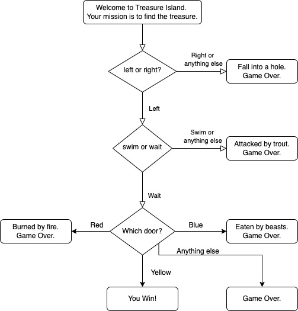

Donkey Island
=============

Programa que muestra el uso de operadores condicionales y lógicos.
Es un juego sencillo en el cual dependiendo de las elecciones que
hace el usuario se va avanzando hacia la meta o pierde en el camino.

El siguiente diagrama muestra la lógica que contiene:

