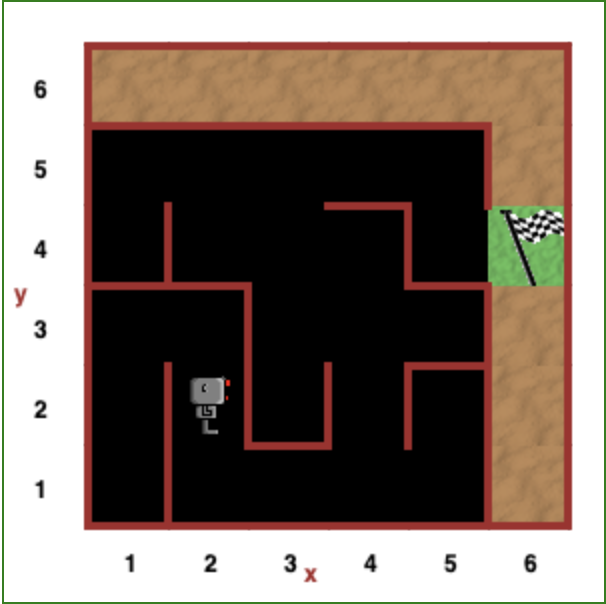

Scaping The Maze
================

Este se realiza para la plataforma interactiva [Reeborg](https://reeborg.ca/reeborg.html?lang=en&mode=python&menu=worlds%2Fmenus%2Freeborg_intro_en.json&name=Maze&url=worlds%2Ftutorial_en%2Fmaze1.json)
en donde se controla un robot a través de funciones predeterminadas para
lograr un objetivo.
Para este caso particular se trata de lograr que el robot salga del laberinto
alcanzando la meta desde cualquier posición inicial.

